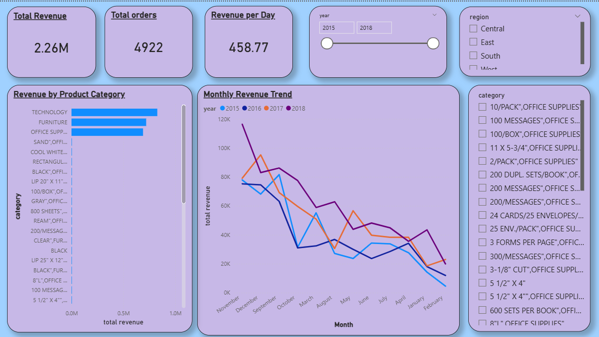
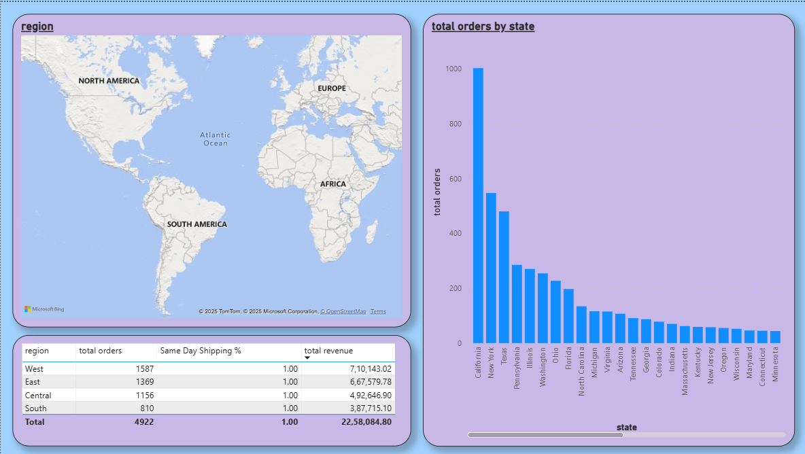
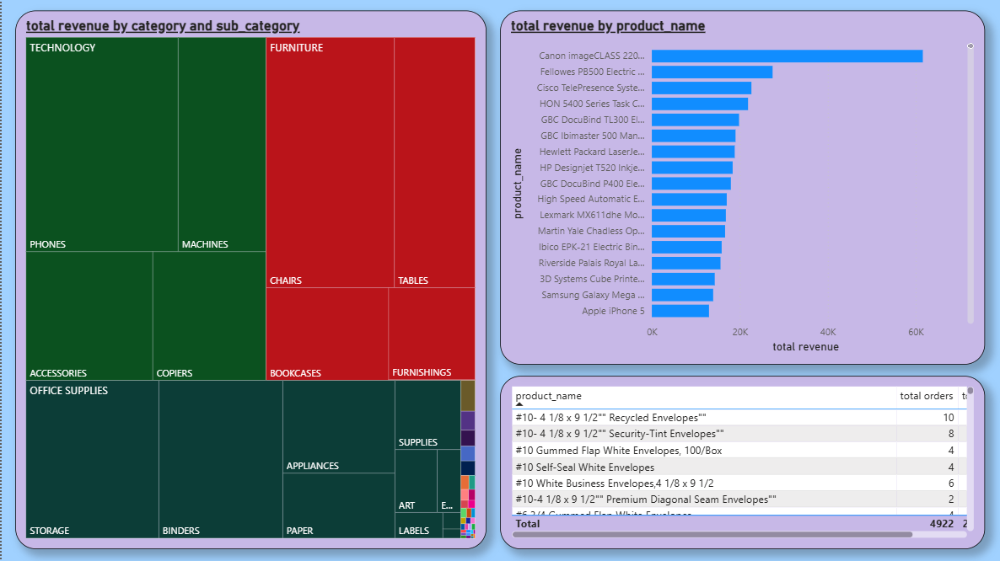
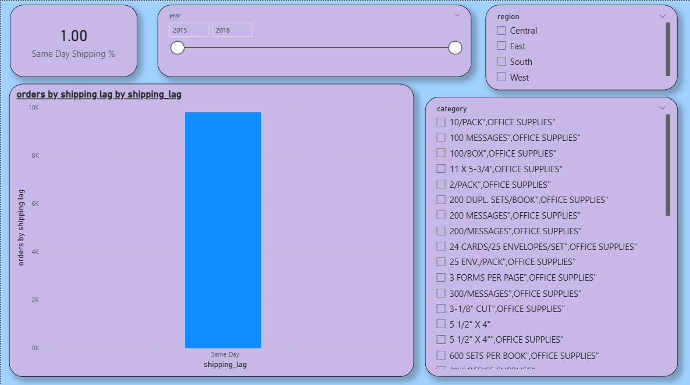

# 🏬 Retail ETL Data Warehouse & Power BI Analytics

## 📌 Project Overview
End-to-end ETL pipeline for retail sales data using MySQL and Power BI.

## 🏗️ Architecture
CSV → Staging → Transformation → Data Warehouse → Power BI

## 🛠️ Tools Used
- MySQL
- SQL
- Power BI
- GitHub

## 🔄 ETL Workflow
1. Data ingestion
2. Data cleaning & transformation
3. Star schema design
4. Fact & dimension loading
5. ETL testing & validation
6. Power BI dashboards

## 📈 Power BI Dashboard Preview

## 🧪 ETL Testing
- Row count reconciliation
- Duplicate detection
- Revenue validation
- Dimension integrity checks

## 🧠 Key Learnings
- Fact grain enforcement
- Source-level deduplication
- Star schema modeling
- Business-ready analytics

## 👤 Author
Aman Singh Tiwari
